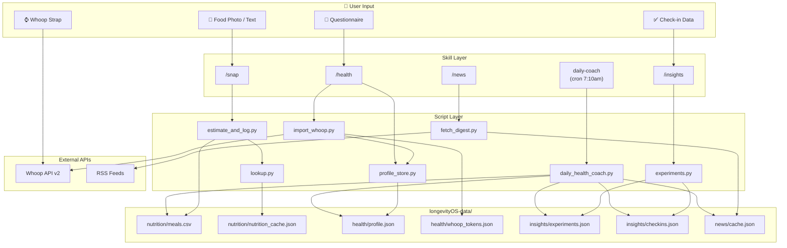
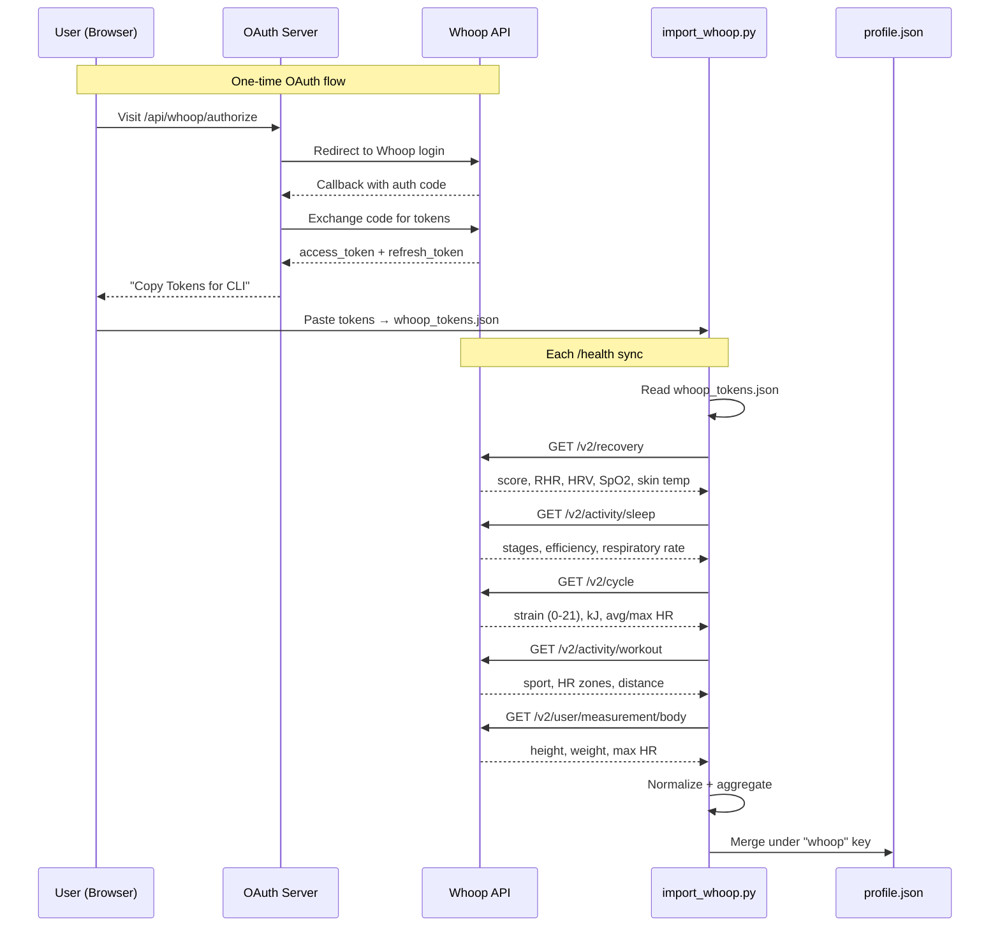

> **Best experience:** Use the latest frontier model (GPT-5.4, Opus 4.6). This guide assumes a working [OpenClaw](https://docs.openclaw.ai) installation.

# compound-clawskill

OpenClaw skill bundle for a personal health companion.

- `/snap` — meal logging with ingredient-level nutrition enrichment
- `/health` — Whoop data import + structured health profile
- `/news` — curated health/longevity digest
- `/insights` — structured self-experiments with gap-aware recommendations
- `daily-coach` — cron-driven personalized daily coaching via 10 specialist subagents

All skills respond to natural language. Say "had salmon with rice for lunch" instead of `/snap`, or "how did I sleep?" instead of `/health`.

## Architecture




## Whoop Integration



## Daily Coach — 10 Specialist Subagents

Every morning, the daily coach cron gathers context from all data stores and dispatches 10 specialist subagents in parallel. Each delivers its own Telegram bubble as it completes.

### The Specialists

<table>
<tr>
<td align="center" width="20%"><br/><b>Imperial Physician</b><br/><sub>Orchestrator — synthesizes #1 priority</sub></td>
<td align="center" width="20%"><br/><b>Diet Physician</b><br/><sub>Nutrition — macros, micros, food suggestions</sub></td>
<td align="center" width="20%"><br/><b>Movement Master</b><br/><sub>Exercise — strain-adjusted training</sub></td>
<td align="center" width="20%"><br/><b>Pulse Reader</b><br/><sub>Body Metrics — RHR, HRV, SpO₂ trends</sub></td>
<td align="center" width="20%"><br/><b>Formula Tester</b><br/><sub>Biomarkers — cross-domain patterns</sub></td>
</tr>
<tr>
<td align="center" width="20%"><br/><b>Herbalist</b><br/><sub>Supplements — micronutrient gap analysis</sub></td>
<td align="center" width="20%"><br/><b>Trial Monitor</b><br/><sub>Experiments — compliance tracking</sub></td>
<td align="center" width="20%"><br/><b>Court Magistrate</b><br/><sub>Trial Design — N-of-1 candidates</sub></td>
<td align="center" width="20%"><br/><b>Medical Censor</b><br/><sub>Safety Review — overtraining, decline flags</sub></td>
<td align="center" width="20%"><br/><b>Court Scribe</b><br/><sub>Reports — relevant research + literature</sub></td>
</tr>
</table>

### Dispatch Flow

<p align="center">
  
</p>

### Example Output

<p align="center">
  
</p>

## Install

Tell your OpenClaw agent:

```
Install the compound-clawskill bundle from https://github.com/compound-life-ai/longClaw
```

Start a **fresh OpenClaw session** after install — skills are snapshotted at session start.

<details>
<summary>Manual install</summary>

```bash
git clone https://github.com/compound-life-ai/longClaw
cd longClaw

# preview
python3 scripts/install_bundle.py --dry-run

# install
python3 scripts/install_bundle.py

# verify
python3 scripts/install_bundle.py --verify

# optional: seed sample data
python3 scripts/install_bundle.py --seed-data
```
</details>

<details>
<summary>Full install instructions for an OpenClaw agent</summary>

```text
1. Clone `https://github.com/compound-life-ai/longClaw` to a stable local path.
2. Change into the cloned repository.
3. Run `python3 scripts/install_bundle.py`.
4. Run `python3 scripts/install_bundle.py --verify`.
5. Confirm that `~/.openclaw/openclaw.json` includes the installed bundle `skills/` path inside `skills.load.extraDirs`.
6. Tell the user to start a new OpenClaw session.
7. Tell the user to verify that `/snap`, `/health`, `/news`, and `/insights` are available.
8. If needed, configure cron templates from `cron/` with their Telegram DM chat id.
9. Ask if they'd like to seed sample data: `python3 scripts/install_bundle.py --seed-data`.
```
</details>

<details>
<summary>Copy-paste uninstall instructions for an OpenClaw agent</summary>

```text
1. Remove any cron jobs referencing `health-brief`, `news-digest`, or `daily-health-coach`.
2. Remove the bundle's `skills/` path from `skills.load.extraDirs` in `~/.openclaw/openclaw.json`.
3. Delete `~/.openclaw/bundles/compound-clawskill`.
4. Start a new OpenClaw session.
```
</details>

## Cron Setup

Replace `__TELEGRAM_DM_CHAT_ID__` in the templates, then:

```bash
openclaw cron add --from-file cron/health-brief.example.json
openclaw cron add --from-file cron/news-digest.example.json
openclaw cron add --from-file cron/daily-health-coach.example.json
```

For the 10-subagent daily coach, add to `~/.openclaw/openclaw.json`:

```json5
{
  agents: {
    defaults: {
      subagents: {
        maxChildrenPerAgent: 10,
        maxConcurrent: 10,
      },
    },
  },
}
```

## Development

```bash
python3 -m unittest discover -s tests -v
```

Tests use real (sanitized) Whoop API response fixtures from `tests/fixtures/whoop/`.

## Repo Layout

```
skill.md            Root meta skill index (natural language routing)
skills/             OpenClaw-facing skill definitions
agents/             Specialist subagent prompts (10 files)
scripts/            Deterministic Python helpers
cron/               Example cron job configs
seed/               Optional fixture data
longevityOS-data/   Runtime data (gitignored)
tests/              Unit and CLI tests
docs/               Architecture and design notes
website/            Next.js landing page
```

## Docs

- [docs/install.md](docs/install.md)
- [docs/openclaw-extension-survey.md](docs/openclaw-extension-survey.md)
- [docs/proposed-health-companion-architecture.md](docs/proposed-health-companion-architecture.md)
- [docs/longevity-os-reference-notes.md](docs/longevity-os-reference-notes.md)
- [docs/news-sources.md](docs/news-sources.md)
