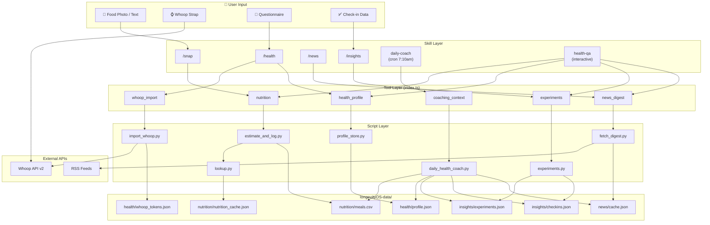
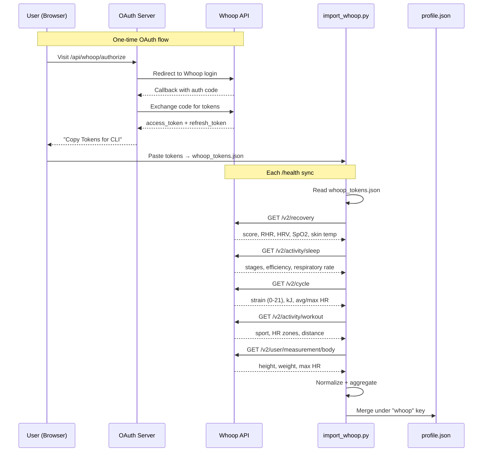

> **Best experience:** Use the latest frontier model (GPT-5.4, Opus 4.6). This guide assumes a working [OpenClaw](https://docs.openclaw.ai) installation.

<p align="center">
  
</p>

<h1 align="center">Turri</h1>

<p align="center"><strong>YOUR HEALTH FINALLY HAS AN EXPERT TEAM.</strong></p>
<p align="center">Turri brings 10 specialist agents to you: they cross-analyze your sleep, meals, biomarkers, and activities, find hidden patterns, and turn scientific evidence into actionable advice.</p>
<p align="center">Personal Health Agent by Compound · Works with Claude Code &amp; OpenClaw</p>

<p align="center">
  <a href="README.zh.md">中文文档</a> ·
  <a href="#overview">Overview</a> ·
  <a href="#how-it-works">How It Works</a> ·
  <a href="#showcases">Showcases</a> ·
  <a href="#quick-start">Quick Start</a> ·
  <a href="#reference">Reference</a>
</p>

<a id="overview"></a>

## Overview

Turri turns longitudinal health data and daily context into a health system you can query, inspect, and act on from a single agentic workflow.

- `/snap` — meal logging with ingredient-level nutrition enrichment
- `/health` — Whoop data import + structured health profile
- `/news` — curated health/longevity digest
- `/insights` — structured self-experiments with gap-aware recommendations
- `daily-coach` — cron-driven personalized daily coaching via 10 specialist subagents
- `health-qa` — interactive health Q&A that routes questions to relevant specialist subagents

All skills respond to natural language. Say "had salmon with rice for lunch" instead of `/snap`, or "how did I sleep?" instead of `/health`.

<a id="how-it-works"></a>

## How It Works

Turri combines OpenClaw skills, deterministic Python helpers, and local data stores so each interaction can stay inspectable while still feeling conversational.

### System Architecture




### Whoop Integration

Whoop is the primary wearable data source today. Turri uses a one-time OAuth flow, stores tokens locally, and merges each sync into the structured health profile.



### Daily Coach — 10 Specialist Subagents

Every morning, the daily coach cron gathers context from all data stores and dispatches 10 specialist subagents in parallel. Each delivers its own Telegram bubble as it completes.

### The Specialists

<table>
<tr>
<td align="center" width="20%"><br/><b>Imperial Physician</b><br/><sub>Orchestrator — synthesizes #1 priority</sub></td>
<td align="center" width="20%"><br/><b>Diet Physician</b><br/><sub>Nutrition — macros, micros, food suggestions</sub></td>
<td align="center" width="20%"><br/><b>Movement Master</b><br/><sub>Exercise — strain-adjusted training</sub></td>
<td align="center" width="20%"><br/><b>Pulse Reader</b><br/><sub>Body Metrics — RHR, HRV, SpO₂ trends</sub></td>
<td align="center" width="20%"><br/><b>Formula Tester</b><br/><sub>Biomarkers — cross-domain patterns</sub></td>
</tr>
<tr>
<td align="center" width="20%"><br/><b>Herbalist</b><br/><sub>Supplements — micronutrient gap analysis</sub></td>
<td align="center" width="20%"><br/><b>Trial Monitor</b><br/><sub>Experiments — compliance tracking</sub></td>
<td align="center" width="20%"><br/><b>Court Magistrate</b><br/><sub>Trial Design — N-of-1 candidates</sub></td>
<td align="center" width="20%"><br/><b>Medical Censor</b><br/><sub>Safety Review — overtraining, decline flags</sub></td>
<td align="center" width="20%"><br/><b>Court Scribe</b><br/><sub>Reports — relevant research + literature</sub></td>
</tr>
</table>

### Dispatch Flow


<a id="showcases"></a>

## Showcases

Turri is designed to feel like a health operating system rather than a pile of separate trackers. These examples show how that experience comes together across coaching, nutrition, pattern detection, and biomarker review.

<details>
<summary>🏥 Daily Coach — 10 specialists review your data every morning</summary>
<p align="center">
  
</p>
</details>

<details>
<summary>🍚 Weekly Nutrition Review — macros, micros, and personalized food suggestions</summary>
<p align="center">
  
</p>
</details>

<details>
<summary>🔍 Pattern Detection — caffeine, sleep, and travel correlations</summary>
<p align="center">
  
</p>
</details>

<details>
<summary>🧪 Blood Work Analysis — biomarker trends and optimization advice</summary>
<p align="center">
  
</p>
</details>

<details>
<summary>🌙 Always On — late night chat, empathetic and human</summary>
<p align="center">
  
</p>
</details>

<a id="quick-start"></a>

## Quick Start

If OpenClaw is already installed, this is the shortest way to get Turri running.

### Install on OpenClaw (Recommended)

Copy and paste the following commands into your OpenClaw chat session.

```bash
# **Install the skills and plugins:**
git clone https://github.com/compound-life-ai/Turri
cd Turri
npm install
openclaw plugins install -l .

# **Setup the daily cron jobs (replace <CHAT_ID> with your Telegram DM chat ID):**

openclaw cron add --name "Health Morning Brief" --cron "0 7 * * *" --tz "America/Los_Angeles" --session isolated --light-context --announce --best-effort-deliver --channel telegram --to "<CHAT_ID>" --message "Use the health and insights skills to create today's morning brief. Summarize yesterday's nutrition totals, the latest Apple Health sleep/activity context, 1-2 lifestyle recommendations, and include the active experiment check-in if relevant. Reply in the user's language and keep it compact."
openclaw cron add --name "Health News Digest" --cron "5 7 * * *" --tz "America/Los_Angeles" --session isolated --light-context --announce --best-effort-deliver --channel telegram --to "<CHAT_ID>" --message "Use the news skill to fetch today's curated digest. Summarize only the highest-signal items for nutrition, sleep, exercise, aging, and self-experimentation. Keep the message concise and mention the source for each item."
openclaw cron add --name "Daily Health Coach" --cron "10 7 * * *" --tz "America/Los_Angeles" --session isolated --light-context --announce --best-effort-deliver --channel telegram --to "<CHAT_ID>" --message "Use the daily-coach skill to generate today's personalized health coaching message. Keep it compact, conservative, and grounded in local health, nutrition, experiment, and cached-news context."

# Verify the plugin loaded correctly:

openclaw plugins doctor
openclaw plugins inspect compound-clawskill

# Start a **fresh OpenClaw session** after install — skills are snapshotted at session start.

# For the 10-subagent daily coach, add to `~/.openclaw/openclaw.json`:
{
  agents: {
    defaults: {
      subagents: {
        maxChildrenPerAgent: 10,
        maxConcurrent: 10,
      },
    },
  },
}
```

### Uninstall

```bash
openclaw plugins uninstall compound-clawskill
```

This removes the plugin registration. The cloned repository and any data in `longevityOS-data/` remain on disk.

To also remove cron jobs, find their IDs with `openclaw cron list`, then:

```bash
openclaw cron remove <job-id>
```

<a id="reference"></a>

## Reference

The sections below keep the full technical detail from the original README and are useful once you want to inspect the plugin boundary, local tooling, or repository structure.

### Plugin & SDK

This is a native [OpenClaw plugin](https://docs.openclaw.ai/plugins/building-plugins) that registers 7 tools via the [Plugin SDK](https://docs.openclaw.ai/plugins/sdk-overview):

| Tool | Description |
|------|-------------|
| `nutrition` | Log meals, daily totals, weekly summary vs RDA |
| `health_profile` | Merge questionnaire/Whoop data, show profile |
| `whoop_initiate` | First-time Whoop OAuth setup and token validation |
| `whoop_sync` | Fetch latest Whoop data and merge into profile |
| `experiments` | Create, check-in, analyze self-experiments |
| `news_digest` | Fetch ranked health/longevity news |
| `coaching_context` | Generate daily coaching context from all data |

Each tool wraps the corresponding Python script in `scripts/` — the SDK entry point (`index.ts`) shells out to them via `execFile`.

Skills in `skills/` provide agent-facing guidance (when to use each tool, how to present results). The tools provide the typed, inspectable interface that OpenClaw registers.

**Relevant OpenClaw docs:**

- [Plugin SDK Overview](https://docs.openclaw.ai/plugins/sdk-overview)
- [Plugin Entry Points](https://docs.openclaw.ai/plugins/sdk-entrypoints)
- [Plugin Manifest](https://docs.openclaw.ai/plugins/manifest)
- [Plugin Architecture](https://docs.openclaw.ai/plugins/architecture)
- [Plugin Setup & Config](https://docs.openclaw.ai/plugins/sdk-setup)
- [Plugin Testing](https://docs.openclaw.ai/plugins/sdk-testing)

### Development

```bash
# Run Python tests
python3 -m unittest discover -s tests -v

# Install Node dependencies before linking the plugin
npm install

# Link plugin for local development
openclaw plugins install -l .
openclaw gateway restart

# Inspect registered tools
openclaw plugins inspect compound-clawskill

# Diagnostics
openclaw plugins doctor
```

If `openclaw plugins doctor` warns that `plugins.allow is empty`, that is a separate trust warning for non-bundled plugins. It does not mean the Turri install itself failed.

Tests use real (sanitized) Whoop API response fixtures from `tests/fixtures/whoop/`.

### Repo Layout

```
index.ts               SDK entry point — registers 7 tools
openclaw.plugin.json   Plugin manifest (skills, config schema)
package.json           Package metadata + openclaw extensions
SKILL.md               Root meta skill (natural language routing)
skills/                OpenClaw-facing skill definitions
agents/                Specialist subagent prompts (10 files)
scripts/               Deterministic Python helpers (called by tools)
cron/                  Example cron job configs
seed/                  Optional fixture data
longevityOS-data/      Runtime data (gitignored)
tests/                 Unit and CLI tests
docs/                  Architecture and design notes
website/               Next.js landing page
```

### Docs

- [docs/install.md](docs/install.md)
- [docs/openclaw-extension-survey.md](docs/openclaw-extension-survey.md)
- [docs/proposed-health-companion-architecture.md](docs/proposed-health-companion-architecture.md)
- [docs/longevity-os-reference-notes.md](docs/longevity-os-reference-notes.md)
- [docs/news-sources.md](docs/news-sources.md)
