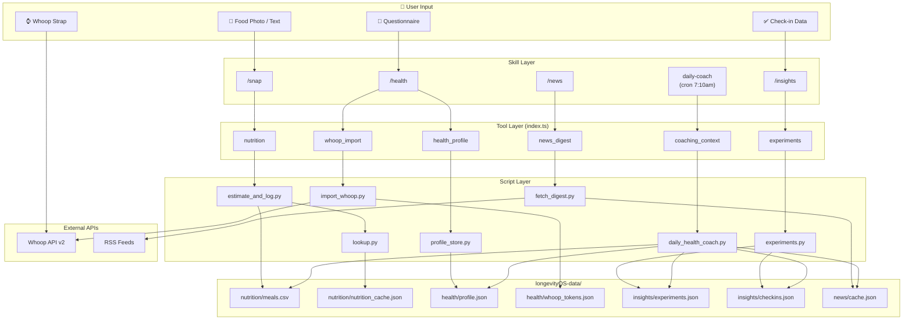
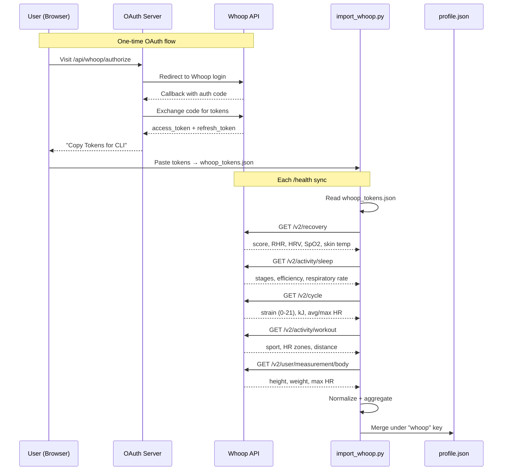

> **Best experience:** Use the latest frontier model (GPT-5.4, Opus 4.6). This guide assumes a working [OpenClaw](https://docs.openclaw.ai) installation.

# compound-clawskill

OpenClaw skill bundle for a personal health companion.

- `/snap` — meal logging with ingredient-level nutrition enrichment
- `/health` — Whoop data import + structured health profile
- `/news` — curated health/longevity digest
- `/insights` — structured self-experiments with gap-aware recommendations
- `daily-coach` — cron-driven personalized daily coaching via 10 specialist subagents

All skills respond to natural language. Say "had salmon with rice for lunch" instead of `/snap`, or "how did I sleep?" instead of `/health`.

## Architecture




## Whoop Integration



## Daily Coach — 10 Specialist Subagents

Every morning, the daily coach cron gathers context from all data stores and dispatches 10 specialist subagents in parallel. Each delivers its own Telegram bubble as it completes.

### The Specialists

<table>
<tr>
<td align="center" width="20%"><br/><b>Imperial Physician</b><br/><sub>Orchestrator — synthesizes #1 priority</sub></td>
<td align="center" width="20%"><br/><b>Diet Physician</b><br/><sub>Nutrition — macros, micros, food suggestions</sub></td>
<td align="center" width="20%"><br/><b>Movement Master</b><br/><sub>Exercise — strain-adjusted training</sub></td>
<td align="center" width="20%"><br/><b>Pulse Reader</b><br/><sub>Body Metrics — RHR, HRV, SpO₂ trends</sub></td>
<td align="center" width="20%"><br/><b>Formula Tester</b><br/><sub>Biomarkers — cross-domain patterns</sub></td>
</tr>
<tr>
<td align="center" width="20%"><br/><b>Herbalist</b><br/><sub>Supplements — micronutrient gap analysis</sub></td>
<td align="center" width="20%"><br/><b>Trial Monitor</b><br/><sub>Experiments — compliance tracking</sub></td>
<td align="center" width="20%"><br/><b>Court Magistrate</b><br/><sub>Trial Design — N-of-1 candidates</sub></td>
<td align="center" width="20%"><br/><b>Medical Censor</b><br/><sub>Safety Review — overtraining, decline flags</sub></td>
<td align="center" width="20%"><br/><b>Court Scribe</b><br/><sub>Reports — relevant research + literature</sub></td>
</tr>
</table>

### Dispatch Flow


### Showcases

<details>
<summary>🏥 Daily Coach — 10 specialists review your data every morning</summary>
<p align="center">
  
</p>
</details>

<details>
<summary>🍚 Weekly Nutrition Review — macros, micros, and personalized food suggestions</summary>
<p align="center">
  
</p>
</details>

<details>
<summary>🔍 Pattern Detection — caffeine, sleep, and travel correlations</summary>
<p align="center">
  
</p>
</details>

<details>
<summary>🧪 Blood Work Analysis — biomarker trends and optimization advice</summary>
<p align="center">
  
</p>
</details>

<details>
<summary>🌙 Always On — late night chat, empathetic and human</summary>
<p align="center">
  
</p>
</details>

## Install / Uninstall

### [Recommended] Have your OpenClaw install this by itself.

** Install the skills and plugins **
```bash
git clone https://github.com/compound-life-ai/longClaw
cd longClaw
openclaw plugins install -l .
```

** Setup the daily cron jobs **

Replace `__TELEGRAM_DM_CHAT_ID__` in the templates, then:

```bash
openclaw cron add --from-file cron/health-brief.example.json
openclaw cron add --from-file cron/news-digest.example.json
openclaw cron add --from-file cron/daily-health-coach.example.json
```

Verify the plugin loaded correctly:

```bash
openclaw plugins doctor
openclaw plugins inspect compound-clawskill
```

Start a **fresh OpenClaw session** after install — skills are snapshotted at session start.

For the 10-subagent daily coach, add to `~/.openclaw/openclaw.json`:

```json5
{
  agents: {
    defaults: {
      subagents: {
        maxChildrenPerAgent: 10,
        maxConcurrent: 10,
      },
    },
  },
}
```

### Uninstall

```bash
openclaw plugins uninstall compound-clawskill
```

This removes the plugin registration. The cloned repository and any data in `longevityOS-data/` remain on disk.

To also remove cron jobs:

```bash
openclaw cron remove health-brief
openclaw cron remove news-digest
openclaw cron remove daily-health-coach
```

## Plugin & SDK

This is a native [OpenClaw plugin](https://docs.openclaw.ai/plugins/building-plugins) that registers 6 tools via the [Plugin SDK](https://docs.openclaw.ai/plugins/sdk-overview):

| Tool | Description |
|------|-------------|
| `nutrition` | Log meals, daily totals, weekly summary vs RDA |
| `health_profile` | Merge questionnaire/Whoop data, show profile |
| `whoop_import` | Fetch and normalize Whoop API data |
| `experiments` | Create, check-in, analyze self-experiments |
| `news_digest` | Fetch ranked health/longevity news |
| `coaching_context` | Generate daily coaching context from all data |

Each tool wraps the corresponding Python script in `scripts/` — the SDK entry point (`index.ts`) shells out to them via `execFile`.

Skills in `skills/` provide agent-facing guidance (when to use each tool, how to present results). The tools provide the typed, inspectable interface that OpenClaw registers.

**Relevant OpenClaw docs:**

- [Plugin SDK Overview](https://docs.openclaw.ai/plugins/sdk-overview)
- [Plugin Entry Points](https://docs.openclaw.ai/plugins/sdk-entrypoints)
- [Plugin Manifest](https://docs.openclaw.ai/plugins/manifest)
- [Plugin Architecture](https://docs.openclaw.ai/plugins/architecture)
- [Plugin Setup & Config](https://docs.openclaw.ai/plugins/sdk-setup)
- [Plugin Testing](https://docs.openclaw.ai/plugins/sdk-testing)

## Development

```bash
# Run Python tests
python3 -m unittest discover -s tests -v

# Link plugin for local development
openclaw plugins install -l .
openclaw gateway restart

# Inspect registered tools
openclaw plugins inspect compound-clawskill

# Diagnostics
openclaw plugins doctor
```

Tests use real (sanitized) Whoop API response fixtures from `tests/fixtures/whoop/`.

## Repo Layout

```
index.ts               SDK entry point — registers 6 tools
openclaw.plugin.json   Plugin manifest (skills, config schema)
package.json           Package metadata + openclaw extensions
SKILL.md               Root meta skill (natural language routing)
skills/                OpenClaw-facing skill definitions
agents/                Specialist subagent prompts (10 files)
scripts/               Deterministic Python helpers (called by tools)
cron/                  Example cron job configs
seed/                  Optional fixture data
longevityOS-data/      Runtime data (gitignored)
tests/                 Unit and CLI tests
docs/                  Architecture and design notes
website/               Next.js landing page
```

## Docs

- [docs/install.md](docs/install.md)
- [docs/openclaw-extension-survey.md](docs/openclaw-extension-survey.md)
- [docs/proposed-health-companion-architecture.md](docs/proposed-health-companion-architecture.md)
- [docs/longevity-os-reference-notes.md](docs/longevity-os-reference-notes.md)
- [docs/news-sources.md](docs/news-sources.md)
