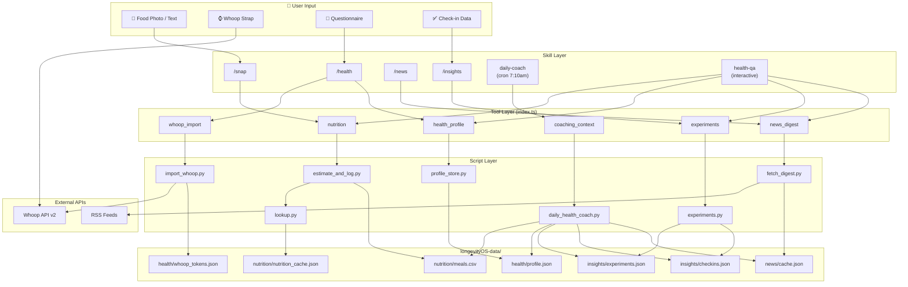
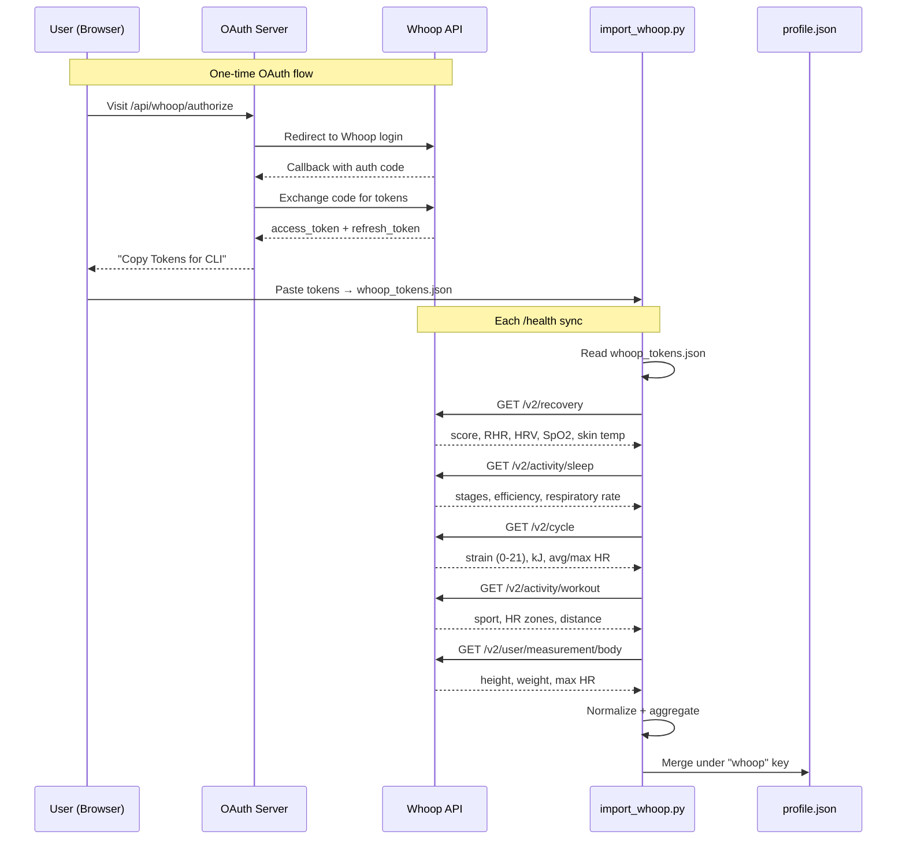
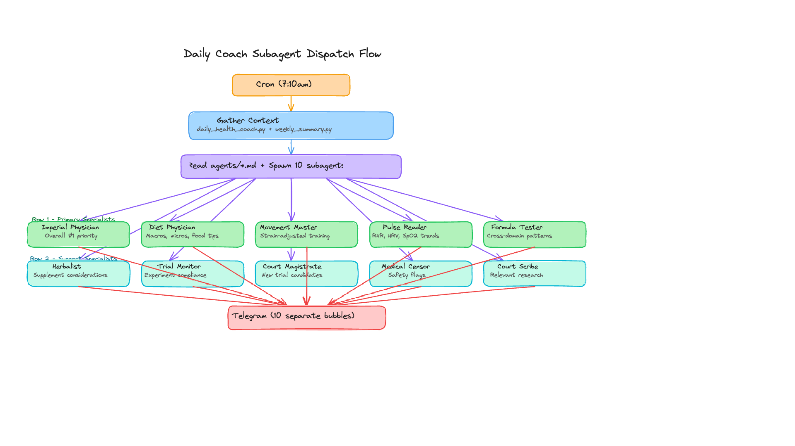
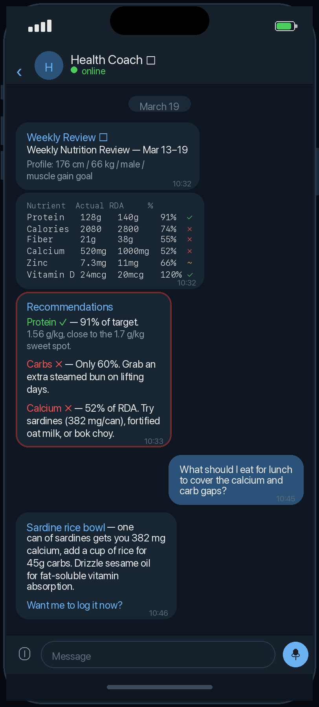
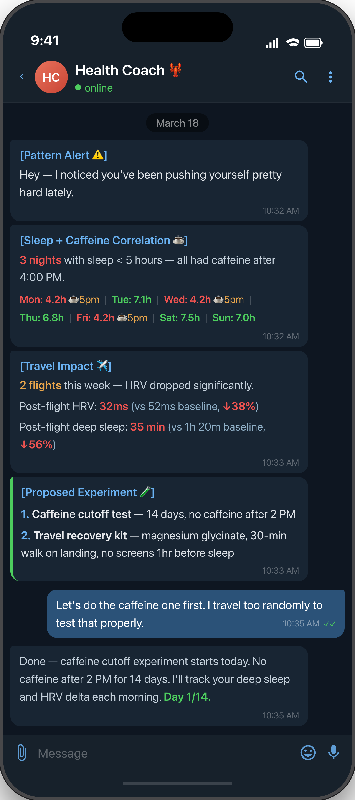
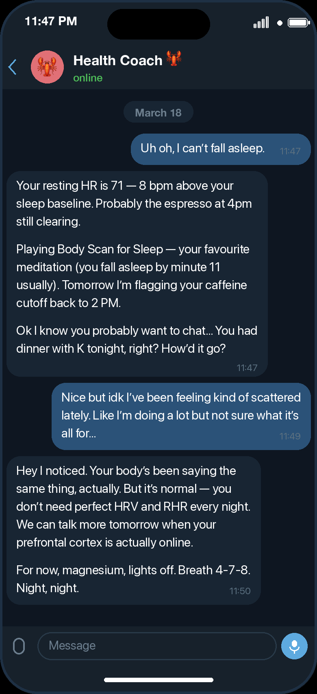

> **最佳体验：** 建议使用最新的 frontier 模型（GPT-5.4、Opus 4.6）。本文默认你已经有一个可用的 [OpenClaw](https://docs.openclaw.ai) 安装。

<p align="center">
  
</p>

<h1 align="center">Turri</h1>

<p align="center"><strong>专属健康Agent：10位专家，全为您服务</strong></p>
<p align="center">Turri是你的「专属太医院」，十位AI御医各司其职，实时「专家会诊」交叉分析你的生理指标、饮食营养、睡眠节律、血液标志物、运动负荷等。发现隐藏关联和趋势、提出可执行建议、校验科学证据、并设计属于你的自我实验。 </p>
<p align="center">Compound 出品的个人健康 Agent · 兼容 Claude Code 与 OpenClaw</p>

<p align="center">
  <a href="README.md">English README</a> ·
  <a href="#overview">概览</a> ·
  <a href="#how-it-works">工作方式</a> ·
  <a href="#showcases">示例</a> ·
  <a href="#quick-start">快速开始</a> ·
  <a href="#reference">参考</a>
</p>

<a id="overview"></a>

## 概览

Turri 把长期健康数据和日常上下文整合成一个可以查询、检查、并采取行动的 agentic health system。

- `/snap` — 记录饮食，并补全到食材级营养信息
- `/health` — 导入 Whoop 数据并生成结构化健康画像
- `/news` — 获取精选的健康 / 长寿资讯摘要
- `/insights` — 管理结构化自我实验，并给出带缺口意识的建议
- `daily-coach` — 由 cron 驱动、调用 10 个 specialist subagent 的每日个性化健康教练
- `health-qa` — 交互式健康问答，会把问题路由给合适的 specialist subagent

所有 skill 都支持自然语言。你可以直接说 “午饭吃了三文鱼配米饭”，而不是 `/snap`；也可以直接问 “我昨晚睡得怎么样？”，而不是 `/health`。

<a id="how-it-works"></a>

## 工作方式

Turri 把 OpenClaw skill、确定性的 Python helper，以及本地数据存储拼成一个整体，让每次交互既可检查、又保持对话式体验。

### 系统架构




### Whoop 集成

Whoop 是目前主要的可穿戴设备数据来源。Turri 通过一次性的 OAuth 流程获取凭证，把 token 存在本地，并在每次同步时把结果合并进结构化健康画像。



### Daily Coach：10 个 Specialist Subagent

每天早上，`daily-coach` 的 cron 会汇总所有数据源的上下文，并并行分发给 10 个 specialist subagent。每个 subagent 完成后都会单独发出一条 Telegram 气泡消息。

### 御医阁：十官

<table>
<tr>
<td align="center" width="20%"><br/><b>太医</b><br/><sub>总协调者，综合得出今日第一优先级</sub></td>
<td align="center" width="20%"><br/><b>食医</b><br/><sub>营养：宏量、微量、食物建议</sub></td>
<td align="center" width="20%"><br/><b>导引师</b><br/><sub>运动：按恢复状态调整训练</sub></td>
<td align="center" width="20%"><br/><b>脉诊师</b><br/><sub>体征：RHR、HRV、SpO₂ 趋势</sub></td>
<td align="center" width="20%"><br/><b>验方师</b><br/><sub>生物标志物：跨领域模式识别</sub></td>
</tr>
<tr>
<td align="center" width="20%"><br/><b>本草师</b><br/><sub>补剂：微量营养素缺口分析</sub></td>
<td align="center" width="20%"><br/><b>试效官</b><br/><sub>实验：执行情况追踪</sub></td>
<td align="center" width="20%"><br/><b>院判</b><br/><sub>试验设计：N-of-1 候选方案</sub></td>
<td align="center" width="20%"><br/><b>医正</b><br/><sub>安全审核：过度训练与异常下降信号</sub></td>
<td align="center" width="20%"><br/><b>报告官</b><br/><sub>报告：相关研究与文献</sub></td>
</tr>
</table>

### 分发流程



<a id="showcases"></a>

## 示例

Turri 不是把一堆 tracker 生硬拼在一起，而是尽量提供一种统一的健康操作系统体验。下面这些例子展示了它如何把教练、营养、模式识别和生物标志物分析串起来。

<details>
<summary>🏥 Daily Coach —— 每天早上由 10 个 specialist 审阅你的数据</summary>
<p align="center">
  
</p>
</details>

<details>
<summary>🍚 每周营养回顾 —— 宏量、微量，以及个性化食物建议</summary>
<p align="center">
  
</p>
</details>

<details>
<summary>🔍 模式检测 —— 咖啡因、睡眠和旅行之间的相关性</summary>
<p align="center">
  
</p>
</details>

<details>
<summary>🧪 血液检测分析 —— 生物标志物趋势与优化建议</summary>
<p align="center">
  
</p>
</details>

<details>
<summary>🌙 随时可聊 —— 深夜也能继续对话，保持同理心和连续性</summary>
<p align="center">
  
</p>
</details>

<a id="quick-start"></a>

## 快速开始

如果你已经安装好了 OpenClaw，下面是启动 Turri 的最短路径。

### 在 OpenClaw 中安装（推荐）

把下面的命令直接复制到你的 OpenClaw chat session 里即可。

```bash
# **Install the skills and plugins:**
git clone https://github.com/compound-life-ai/Turri
cd Turri
npm install
openclaw plugins install -l .

# **Setup the daily cron jobs (replace <CHAT_ID> with your Telegram DM chat ID):**

openclaw cron add --name "Health Morning Brief" --cron "0 7 * * *" --tz "America/Los_Angeles" --session isolated --light-context --announce --best-effort-deliver --channel telegram --to "<CHAT_ID>" --message "Use the health and insights skills to create today's morning brief. Summarize yesterday's nutrition totals, the latest Apple Health sleep/activity context, 1-2 lifestyle recommendations, and include the active experiment check-in if relevant. Reply in the user's language and keep it compact."
openclaw cron add --name "Health News Digest" --cron "5 7 * * *" --tz "America/Los_Angeles" --session isolated --light-context --announce --best-effort-deliver --channel telegram --to "<CHAT_ID>" --message "Use the news skill to fetch today's curated digest. Summarize only the highest-signal items for nutrition, sleep, exercise, aging, and self-experimentation. Keep the message concise and mention the source for each item."
openclaw cron add --name "Daily Health Coach" --cron "10 7 * * *" --tz "America/Los_Angeles" --session isolated --light-context --announce --best-effort-deliver --channel telegram --to "<CHAT_ID>" --message "Use the daily-coach skill to generate today's personalized health coaching message. Keep it compact, conservative, and grounded in local health, nutrition, experiment, and cached-news context."

# Verify the plugin loaded correctly:

openclaw plugins doctor
openclaw plugins inspect compound-clawskill

# Start a **fresh OpenClaw session** after install — skills are snapshotted at session start.

# For the 10-subagent daily coach, add to `~/.openclaw/openclaw.json`:
{
  agents: {
    defaults: {
      subagents: {
        maxChildrenPerAgent: 10,
        maxConcurrent: 10,
      },
    },
  },
}
```

### 卸载

```bash
openclaw plugins uninstall compound-clawskill
```

这会移除插件注册信息。已克隆的仓库，以及 `longevityOS-data/` 下的数据，仍然会保留在本地磁盘上。

如果还要移除 cron 任务，先用 `openclaw cron list` 找到对应的 ID，然后执行：

```bash
openclaw cron remove <job-id>
```

<a id="reference"></a>

## 参考

下面这些部分保留了原始 README 里的完整技术细节，适合在你想进一步查看插件边界、本地工具链或仓库结构时使用。

### Plugin 与 SDK

这是一个原生的 [OpenClaw plugin](https://docs.openclaw.ai/plugins/building-plugins)，通过 [Plugin SDK](https://docs.openclaw.ai/plugins/sdk-overview) 注册了 7 个工具：

| Tool | Description |
|------|-------------|
| `nutrition` | Log meals, daily totals, weekly summary vs RDA |
| `health_profile` | Merge questionnaire/Whoop data, show profile |
| `whoop_initiate` | First-time Whoop OAuth setup and token validation |
| `whoop_sync` | Fetch latest Whoop data and merge into profile |
| `experiments` | Create, check-in, analyze self-experiments |
| `news_digest` | Fetch ranked health/longevity news |
| `coaching_context` | Generate daily coaching context from all data |

每个工具都包了一层 `scripts/` 里的 Python 脚本。SDK 入口（`index.ts`）通过 `execFile` 去调用这些脚本。

`skills/` 目录里的内容为 agent 提供使用指引，例如什么时候调用哪个工具、如何组织结果。工具本身则提供 OpenClaw 可注册、可检查的类型化接口。

**相关 OpenClaw 文档：**

- [Plugin SDK Overview](https://docs.openclaw.ai/plugins/sdk-overview)
- [Plugin Entry Points](https://docs.openclaw.ai/plugins/sdk-entrypoints)
- [Plugin Manifest](https://docs.openclaw.ai/plugins/manifest)
- [Plugin Architecture](https://docs.openclaw.ai/plugins/architecture)
- [Plugin Setup & Config](https://docs.openclaw.ai/plugins/sdk-setup)
- [Plugin Testing](https://docs.openclaw.ai/plugins/sdk-testing)

### 开发

```bash
# Run Python tests
python3 -m unittest discover -s tests -v

# 先安装 Node 依赖，再 link 插件
npm install

# Link plugin for local development
openclaw plugins install -l .
openclaw gateway restart

# Inspect registered tools
openclaw plugins inspect compound-clawskill

# Diagnostics
openclaw plugins doctor
```

如果 `openclaw plugins doctor` 提示 `plugins.allow is empty`，那是针对非内置插件的信任告警，不代表 Turri 安装失败。

测试使用了来自 `tests/fixtures/whoop/` 的真实（已脱敏）Whoop API 响应样本。

### 仓库结构

```
index.ts               SDK entry point — registers 7 tools
openclaw.plugin.json   Plugin manifest (skills, config schema)
package.json           Package metadata + openclaw extensions
SKILL.md               Root meta skill (natural language routing)
skills/                OpenClaw-facing skill definitions
agents/                Specialist subagent prompts (10 files)
scripts/               Deterministic Python helpers (called by tools)
cron/                  Example cron job configs
seed/                  Optional fixture data
longevityOS-data/      Runtime data (gitignored)
tests/                 Unit and CLI tests
docs/                  Architecture and design notes
website/               Next.js landing page
```

### 文档

- [docs/install.md](docs/install.md)
- [docs/openclaw-extension-survey.md](docs/openclaw-extension-survey.md)
- [docs/proposed-health-companion-architecture.md](docs/proposed-health-companion-architecture.md)
- [docs/longevity-os-reference-notes.md](docs/longevity-os-reference-notes.md)
- [docs/news-sources.md](docs/news-sources.md)
